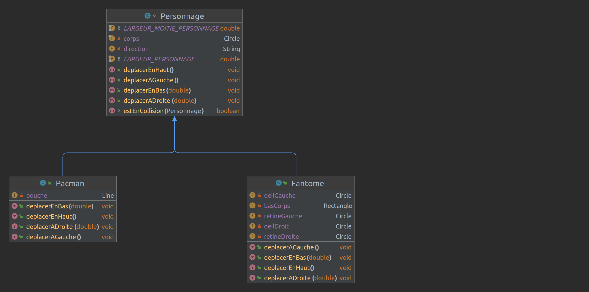

# 
# Développement d’applications avec IHM

### IUT Montpellier-Sète – Département Informatique

* [**Support de cours**](https://gitlabinfo.iutmontp.univ-montp2.fr/ihm/ressources)
* **Enseignants:**
    * [Sophie Nabitz](mailto:sophie.nabitz@univ-avignon.fr),
      [Cyrille Nadal](mailto:cyrille.nadal@umontpellier.fr),
      [Nathalie Palleja](mailto:nathalie.palleja@umontpellier.fr),
      [Xavier Palleja](mailto:xavier.palleja@umontpellier.fr),
      [Petru Valicov](mailto:petru.valicov@umontpellier.fr)
* Le [forum Piazza](https://piazza.com/class/lfmbartihpv60i) de ce cours pour poser vos questions
* [Email](mailto:petru.valicov@umontpellier.fr) pour une question d'ordre privée concernant le cours.


Comme pour les TPs du cours _Développement Orienté Objets_, vous devrez ici aussi travailler dans un groupe [GitLab associé au cours d'IHM](https://gitlabinfo.iutmontp.univ-montp2.fr/ihm/). Dans ce groupe, vous aurez l'ensemble des forks des TPs et du projet qui apparaîtront au fur et à mesure.

Nous vous conseillons fortement de travailler avec IntelliJ IDEA. Vous pouvez aussi utiliser un autre IDE, mais dans ce cas, ce sera à vous de vous adapter.

Également, comme pour le cours _Développement Orienté Objets_, vous allez utiliser [Maven](https://fr.wikipedia.org/wiki/Apache_Maven) comme système de build pour vos projets JavaFX. Voici la structure d'un projet JavaFX construit avec Maven :


Ainsi le répertoire **src/main/java** contiendra :
* L'ensemble des paquetages de votre application ; dans l'exemple de l'image ci-dessus il n'y en a qu'un -- `fr.exemple.AppliJavaFX`.
* Un fichier spécial `module-info.java` qui décrit l'ensemble des paquetages externes utilisés dans votre application. En l'occurrence, les paquetages de la librairie JavaFX (on vous rappelle que JavaFX ne fait partie de l'API native Java). Les modules constituent une fonctionnalité importante de Java depuis la version 9 de la plateforme. Ils permettent de construire des exécutables légers (_.jar_) en y encapsulant l'ensemble de dépendances nécessaires au bon fonctionnement. En quelque sorte, on peut les voir comme une généralisation de la notion de paquetage. Pour plus de détails :
    * https://en.wikipedia.org/wiki/Java_Platform_Module_System
    * https://en.wikipedia.org/wiki/Modular_programming
    * https://www.baeldung.com/java-9-modularity
    * https://www.oracle.com/fr/corporate/features/understanding-java-9-modules.html

Le répertoire **src/main/resources** contiendra l'ensemble de ressources du projet : images, feuilles de styles CSS, les fichiers `.fxml` contenant la description déclarative de vos interfaces graphiques, etc.

Le répertoire **src/main/test** contiendra l'intégralité des tests de votre application. Notez que pour le moment vous n'allez pas écrire des tests unitaires pour tester vos IHM, donc le répertoire **src/main/test** n'apparaîtra pas pour le moment dans vos projets. Au moment où voudrez ajouter des tests unitaires, vous aurez éventuellement à créer ce répertoire.


Tout au long du TP, vous aurez besoin de **consulter [les pages de documentation de JavaFX](https://openjfx.io/javadoc/18/)**. Dans ce cours, nous allons travailler sur la **version 17 de Java et version 18 de JavaFX**. Sur les machines du département tout est déjà installé et configuré. Si vous travaillez sur votre machine personnelle, pensez à installer les bonnes versions.

#### Consignes installation sur machine personnelle

Notez que depuis 2018 JavaFX ne fait pas partie de l'API Java officielle, le développement étant externalisé dans la communauté [OpenJDK](https://openjdk.java.net/) dans le projet [OpenJFX](https://wiki.openjdk.java.net/display/OpenJFX/Main).

C'est pour cela que la librairie JavaFX n'est pas automatiquement installée avec la plateforme Java. Pour installer JavaFX sur votre machine, on vous recommande de télécharger la SDK complète : https://gluonhq.com/products/javafx/. Sur Linux, il suffit d'extraire l'archive contenant la SDK dans votre répertoire d'installation, par exemple dans `/opt`. Lors de la première utilisation de JavaFX avec votre IDE, vous devriez indiquer le chemin d'accès à la SDK JavaFX sur votre machine.

## TP 1 : Premiers pas avec JavaFX

Rappelez-vous que JavaFX est un framework Java pour le développement des interfaces graphiques (GUI) en Java. Une GUI JavaFX est construite grâce à un **graphe de scène**, où les **nœuds** correspondent à un ensemble d'éléments graphiques organisés de manière hiérarchique. La scène (un objet de type [`Scene`](https://openjfx.io/javadoc/18/javafx.graphics/javafx/scene/Scene.html)) est associée à une fenêtre qui correspond à un objet de type [`Stage`](https://openjfx.io/javadoc/18/javafx.graphics/javafx/stage/Stage.html).

En principe, une application peut avoir plusieurs fenêtres, mais une est obligatoire -- la fenêtre principale (**primary stage** en anglais). Celle-ci est fournie automatiquement par l'environnement d'exécution JavaFX. Ainsi, l'exécution du code suivant lance une fenêtre vide et cachée (non visible à l'utilisateur) :

```java
import javafx.application.Application;
import javafx.stage.Stage;

public class MaPremiereClasseJavaFX extends Application {

    @Override
    public void start(Stage primaryStage) {
        // le code pour enrichir votre fenêtre
    }
}
```

Notez que la méthode `main(String args[]` n'est pas nécessaire ici, car le point d'entrée d'une application JavaFX est la méthode `start(Stage primaryStage)`. En revanche, vous pouvez toujours ajouter une méthode `main(String args[]` car souvent, c'est plus pratique (par exemple, ajouter des paramètres à la ligne de commande).

```java
import javafx.application.Application;
import javafx.stage.Stage;

public class MaPremiereClasseJavaFX extends Application {

  public static void main(String[] args) {
    // ici, on peut passer des arguments à l'application JavaFX
    Application.launch(args);
  }
  
  @Override
  public void start(Stage primaryStage) {
    // le code pour enrichir votre fenêtre
    primaryStage.setTitle("La page d'un Pro de JavaFX !"); // titre de la fenêtre
    primaryStage.show(); // rendre la fenêtre visible
  }
}
```
Dans le code ci-dessus la méthode statique `launch(String[] args)` de la classe `javafx.application.Application` va déclencher la méthode dynamique `start(Stage primaryStage)`. Notez que JavaFX est conçu de façon à ce que la méthode `launch(String[] args)` détecte correctement la méthode `start(Stage primaryStage)` à exécuter en fonction de la classe héritant de `Application` où `launch(String[] args)` a été lancée. Dans l'exemple ci-dessus cette classe est `MaPremiereClasseJavaFX`.

L'exécution de ce code produit une fenêtre vide, mais visible. Cette fenêtre possède un titre et voici comment elle s'affiche sur Linux :


Si vous êtes sur un autre système d'exploitation (Windows, Mac OS, etc.) le design de la fenêtre sera différent, l'environnement JavaFX faisant le travail nécessaire d'adaptation. Dans tous les cas, cette fenêtre contiendra une barre de titre et un emplacement pour afficher la scène.

## Partie 1 - Le graphe de scène et quelques événements

Dans les exercices de cette partie vous allez personnaliser votre fenêtre JavaFX avec différents éléments graphiques en construisant le graphe de scène. Pensez à consulter le [cours](https://www.lirmm.fr/~pvalicov/Cours/ihm/Introduction_handout.pdf) pour vous aider dans chaque question.

### Exercice 1 - Contrôles de base

Pour commencer simplement, nous allons construire une petite application graphique qui correspond au *"Bonjour à tous"* traditionnel... <br/>
A la fin de chaque question, vous ferez exécuter votre nouvelle version de l'application. Pensez aussi à committer (et pousser) régulièrement sur votre dépôt GitLab.

1. Lisez le contenu de la classe `MaPremierFenetreJavaFX` du paquetage `fr.umontpellier.iut.exercice1` et faites exécuter la méthode `main(String args[])`. Modifiez le titre de la fenêtre en *"Hello Application"* et fixez la largeur et la hauteur à 400 (`setWidth` et `setHeight`).

2. Dans la méthode `start(Stage primaryStage)`, instanciez un conteneur [`VBox`](https://openjfx.io/javadoc/18/javafx.graphics/javafx/scene/layout/VBox.html), et précisez que les éléments qu'il contiendra seront centrés (en utilisant sa méthode `setAlignment(Pos p)`). Vous y ajouterez un [`Label`](https://openjfx.io/javadoc/18/javafx.controls/javafx/scene/control/Label.html) dont le texte actuel est *"Bonjour à tous !"*.
   Déclarez ensuite une [scène](https://openjfx.io/javadoc/18/javafx.graphics/javafx/scene/Scene.html) dans laquelle vous placerez votre conteneur et ajoutez cette scène à votre fenêtre principale (objet de la classe `Stage`).

3. Ajoutez maintenant un [`TextField`](https://openjfx.io/javadoc/18/javafx.controls/javafx/scene/control/TextField.htmlcontrol/TextField.html) qui permettra de saisir un nom et fixez-en la largeur maximale (`setMaxWidth`) à 150. Puis ajoutez un [`Button`](https://openjfx.io/javadoc/18/javafx.controls/javafx/scene/control/Button.html) construit avec le texte *"Dire bonjour"*.

    1. Vous allez maintenant ajouter un [gestionnaire d'événement](https://openjfx.io/javadoc/18/javafx.base/javafx/event/EventHandler.html) sur ce bouton afin d'intercepter l'action de clic sur ce bouton et lui associer une action de réponse spécifique. Dans un premier temps, vous l'ajouterez sous la forme d'une expression lambda (```actionEvent -> { ... }```). Une action sur ce bouton aura pour effet de transformer le texte du `Label` en *"Bonjour à toi, César"*, quand le texte *César* a été saisi dans le `TextField`.

    2. Transformez ensuite l'expression lambda en un attribut `final` de la classe, de type `EventHandler<ActionEvent>`. Vous serez amener à déplacer vos composants, qui deviennent maintenant des attributs de la classe. Ici, vous avez la possibilité d'instancier votre attribut `EventHandler<ActionEvent>` en tant que [classe anonyme](https://docs.oracle.com/javase/tutorial/java/javaOO/anonymousclasses.html) ou bien en tant qu'objet d'une classe héritant de `EventHandler<ActionEvent>` que vous allez déclarer explicitement.

    3. Faites en sorte qu'en tapant la touche _Entrée_ du clavier lors de la saisie du `TextField`, la même action que le clic du bouton, se déclenche.

4. Vous allez maintenant faire un peu de mise en forme... <br/>
   Remplacez le texte du bouton par une image : pour cela, déclarez un objet de la classe [`ImageView`](https://openjfx.io/javadoc/18/javafx.graphics/javafx/scene/image/ImageView.html) construit avec cette
   [URL](https://gitlabinfo.iutmontp.univ-montp2.fr/ihm/tp1/-/blob/master/images/logo.jpeg) et utilisez la méthode `setGraphic(Node n)` sur le bouton. Notez que cette méthode reçoit un objet de type `Node` de JavaFX en paramètre et [`ImageView`](https://openjfx.io/javadoc/18/javafx.graphics/javafx/scene/image/ImageView.html) est une de ses nombreuses sous-classes.<br/>
   Changez la fonte du `TextField` en Courier 15 (`Font.font("Courier", FontWeight.NORMAL, 15)`) et celle du `Label` en 30 et bold.<br/>
   Essayez aussi de changer l'image du bouton en utilisant la ressource *"Bonjour.jpg"* qui vous est fournie dans le répertoire _src/main/resources/exercice1/_.<br/>
   Enfin, utilisez le fichier *"Bonjour.css"* pour configurer la scène, en utilisant <ul> `scene.getStylesheets().add(getClass().getClassLoader().getResource("exercice1/Bonjour.css").toExternalForm());`.</ul>

### Exercice 2 - Conteneurs BorderPane et HBox

Vous devez écrire une application dont la fenêtre initiale est la suivante :


Un clic sur un des boutons (ici 3 clics sur le vert) donnera le résultat suivant :


Vous utiliserez pour cela un conteneur `BorderPane` (taille 400 sur 200), dont l'élément du haut est un `Label` centré, celui du milieu un `Pane` et celui du bas une `HBox` de `Button`. Le changement de couleur d'un panneau se fait en utilisant la méthode `setStyle(String s)`.

### Exercice 3 - Conteneur GridPane

Reproduisez la fenêtre suivante en utilisant un conteneur `GridPane`:


Cette fenêtre est déplaçable, mais pas redimensionnable (`initStyle(StageStyle.UTILITY)`)
Les 9 éléments sont des `Label`, dont vous aurez défini les "graphiques" en utilisant les 3 fichiers qui sont fournis dans le répertoire _resources/exercice3_. L'image à afficher sera choisie aléatoirement : pour cela, vous pouvez faire générer un nombre entre 0 et 2, à partir d'un objet `Random`:
```java
Random random = new Random();
int nombre = random.nextInt(3);
```


### Exercice 4 - Jeu de type PacMan.

**Objectif :** afficher un pacman, un fantôme, les faire se déplacer au clavier, détecter les éventuelles collisions.

Dans un jeu PacMan les personnages (classe `Personnage`) ont tous un corps sous forme de cercle et une direction de déplacement.

- Un objet de type `Pacman` sera un `Personnage` qui comporte _une bouche_, la bouche est orientée vers la droite, gauche, bas, haut en fonction de sa direction.

- Un objet de type `Fantome` sera un `Personnage` qui comporte _un bas de corps_, _un œil gauche_, _une rétine gauche_, _un œil droit_ et _une rétine droite_, les rétines seront orientées en fonction de sa direction.

- Les objets de type `Fantome` et `Pacman` pourront se déplacer dans les 4 directions du plan de jeu avec des touches différentes du clavier, ils ne peuvent _pas sortir du plan de jeu_.

- Il sera possible de **détecter la collision** entre deux personnages (ou éléments du jeu) se touchant.

- La classe `JeuMain` est chargée de lancer le jeu dans une fenêtre 640*480, chaque personnage est pour l’instant stocké dans un carré de 20 pixels de côté.

**Diagramme de classes :**




Le _code fourni_ permet d’afficher le plan de jeu, un pacman qui se dirige vers la **droite** ou vers la **gauche**, un fantôme **qui ne bouge pas** pour l’instant.


**État initial :**


**Le pacman s’est déplacé à droite**


**Puis repart vers la gauche**


1 - **Complétez** la classe `Pacman` afin que soient pris en compte les déplacements bas et haut. Les touches de déplacement seront les touches du clavier UP, DOWN, LEFT et RIGHT

 

2 - **Complétez** la classe `Fantome` afin que soient pris en compte les déplacements haut, bas, gauche et droite. Les touches de déplacement seront Z, S, Q et D. Les yeux du fantôme suivront la direction comme cela :


3 - Pour l’instant la collision affiche un message dans la console. Trouvez un moyen de **stopper le jeu** lorsqu'une collision se produit.

4 - **Ajoutez des obstacles infranchissables** (murs, etc), faites en sorte de placer le pacman et le fantôme aux extrémités du jeu.<br>
**Algo à mettre en place**

- Créez un ou des **obstacles** (nouvelle classe `Obstacle` héritant de `Rectangle`) et stockez-les dans `JeuMain` (Arraylist static...)
- Lors du déplacement d'un `Personnage` (haut, bas, droite ou gauche), _sauvegardez_ sa position (`x` et `y`), faites le _déplacement voulu_, _détectez_ une collision avec un obstacle (détection de collision avec un des obstacles), si collision _détectée_ **repositionnez** le personnage avec les coordonnées sauvegardées.


5 - **Imaginez** une suite, un mode de jeu rapide par exemple le jeu se lance, le gagnant sera soit le pacman s’il atteint le fantôme en moins de 10 secondes, soit le fantôme s’il réussit à échapper au pacman au bout des 10 secondes…

## Partie 2 - FXML

Comme vous l'avez pu constater dans les exercices précédents, l'intégralité du code d'organisation des composants graphiques et les traitements correspondants étaient définis dans le même bloc de code Java. Par exemple, pour le jeu Pacman de l'exercice 4, la classe `JeuMain` gérait à la fois les composants principaux du graphe de scène du jeu, mais aussi la gestion des mouvements des personnages. Cette approche (dite _procédurale_) marche tant que le code de l'IHM n'est pas trop complexe. Mais le code deviendra ingérable dès que votre IHM contiendra des nombreux composants graphiques (potentiellement imbriqués), avec beaucoup de code de traitement associé.

Par ailleurs, rappelons qu'un des avantages d'utiliser JavaFX est la possibilité de décrire les interfaces graphiques de manière déclarative dans un langage dérivé du XML -- le FXML. Le graphe de scène ayant une structure arborescente, la description de celui-ci en XML est assez intuitive.

Ainsi, utiliser le FXML permet de séparer la logique de construction de l'interface utilisateur (_UI_), du code métier de l'application (_business logic_). Cette séparation devient très vite utile (voire nécessaire) lorsque la fenêtre a beaucoup de composants graphiques (potentiellement imbriqués), auxquels sont attachés des écouteurs. De plus, décrire les interfaces devient plus simple avec FXML comparé à l'approche procédurale.

Dans cette partie, nous allons voir comment construire des interfaces graphiques en utilisant le FXML.

### Exercice 5 - Utilisation de FXML

Consultez les classes du paquetage `exercice4` : vous reconnaissez en partie le code de `CounterMain`, qui définit la fenêtre principale, et dont la structure est chargée à partir du fichier ressource *"CounterView.fxml"* du répertoire *"resources/exercice4"*.<br/>
Le contenu de `CounterView.fxml` définit la racine de la scène comme un conteneur `BorderPane`, dont l'élément au centre est un `VBox`. Ce dernier contient un `Label`et un conteneur `HBox`, lui-même contenant deux boutons.<br/>Le nom de chacun de ces éléments est donné par l'attribut `fx:id`.

Complétez la classe `CounterController` en déclarant les attributs correspondant aux éléments du fichier *fxml* et annotez-les avec `@FXML`. Initialisez le texte du `Label` avec la chaîne *"0"*.

Écrivez le code des deux méthodes `increment()`et `decrement()`, qui font varier la valeur de l'attribut counter, et modifient le texte du `Label`. Associez ces méthodes avec les éléments du fichier *fxml*, en ajoutant dans les balises appropriées les attributs `onAction="#increment"` et `onAction="#decrement"`.<br/>

Associez enfin les fichiers `CounterController.java` et `CounterView.fxml` en ajoutant dans la balise racine un attribut `fx:controller` de valeur égale au nom complet de la classe (c'est-à-dire en précisant aussi le package dans lequel elle est définie).

### Exercice 6 - Création de l'IHM en FXML et SceneBuilder

Constatez, dans la classe `LoginControl`, que nous définissons ici un nouveau contrôle, basé sur un `GridPane`, et qui pourra donc être utilisé par la suite comme un nouveau composant en soi. C'est d'ailleurs ce qui est fait dans la classe `LoginMain`.

Vous allez utiliser le [SceneBuilder](https://gluonhq.com/products/scene-builder/) pour construire la fenêtre suivante (la racine de la scène étant un conteneur `GridPane`), en complétant le fichier *fxml* donné :


Pour ouvrir le fichier *fxml* avec [SceneBuilder](https://gluonhq.com/products/scene-builder/) dans IntelliJ IDEA : clic droit sur le fichier *fxml* &rightarrow; *Open in SceneBuilder*. Si vous utilisez le SceneBuilder pour la première fois, il faut indiquer à l'IDE le chemin d'accès à l'exécutable de ce logiciel. À l'IUT, sur les postes Linux, il réside dans `/opt/scenebuilder/bin/`. Si vous êtes sur votre machine personnelle, il faudrait que vous installiez d'abord [SceneBuilder](https://gluonhq.com/products/scene-builder/) et ensuite indiquiez à l'IDE le chemin d'accès.

Le fichier *CSS* vous est fourni, il n'est pas nécessaire de le modifier. Vous l'associerez à votre contrôle en utilisant la possibilité du panneau _Properties_ de la racine.

La totalité de la classe `LoginMain` vous est fournie, et vous devez compléter la classe `LoginControl` en déclarant les attributs manquants (qui correspondent aux éléments du fichier *fxml*) et en implémentant les actions des deux boutons.<br/>
Un clic sur le bouton _OK_ affiche sur la console le nom de l'utilisateur et une suite d'étoiles dont la longueur correspond au nombre de caractères du mot de passe, et un clic sur _Cancel_ vide les deux champs.

### Exercice 7 - Animations

Regardez (et exécutez) le code fourni dans la classe `Animation`, et transformez-le pour que l'image fasse le tour de la fenêtre, puis revienne automatiquement en sens inverse.
